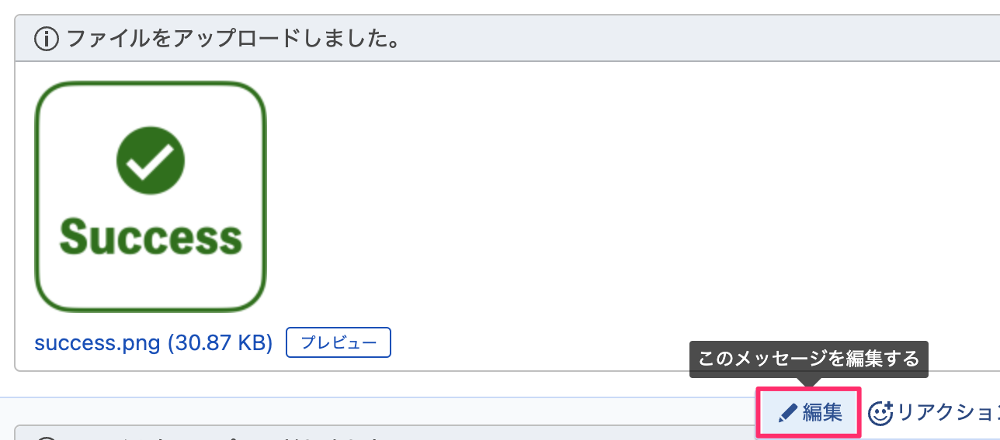
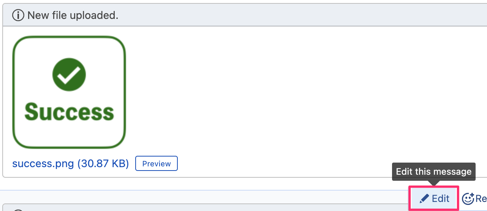
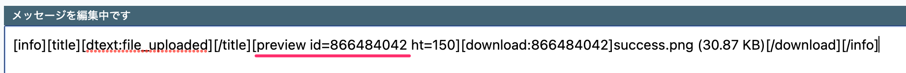
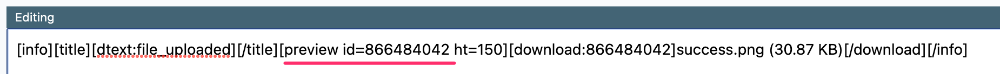

# orbs-chatwork

[](https://circleci.com/gh/RHEMS-Japan/orbs-chatwork) 


## Chatwork Orb For CircleCi

このorbは、CircleCiのpipelineコンフィグから、簡単にchatworkへメセージを送ることができるorbです。

This orb can easily send a message to chatwork from part of your CI / CD pipeline.

## Usage
### Get API Token

初めに、下記URLにアクセスし、ログインしたらAPI Tokenを発行して下さい。

First, access the URL below, log in, and issue an API Token.

https://www.chatwork.com/service/packages/chatwork/subpackages/api/token.php


### Set Environment Variables from CircleCi Project Settings

発行したAPI Tokenを、利用するCircleCi Projectの環境変数に`CHATWORK_TOKEN`という名前で登録して下さい。

Register the issued API Token in the environment variable of the CircleCi Project to be used with the name `CHATWORK_TOKEN`.


### How to write `.circleci/config.yml`

chatworkのroom idをURLから確認します。以下の場合、room idは`123456789`となります。

Check the chatwork room id from the URL. In the following cases, the room id is `123456789`.

```
https://www.chatwork.com/#!rid123456789
```

下記は、指定したroom idに`hello`と送る例です。

The following is an example of sending `hello` to the specified room id.

```yml
version: 2.1

orbs:
  rj-chatwork: rhems-japan/chatwork@a.b.c

jobs:
  something-job:
    docker:
      - image: cimg/base:stable
    steps:
      - checkout
      - rj-chatwork/chatwork-send:
          room_id: "123456789"
          body: hello
```

### What if you want to send an image?

chatworkに送るメッセージに画像を利用したい場合は、事前に準備が必要です。
利用するroom idのチャンネルに、画像をアップロードしておきます。
例えば、当リポジトリに用意した`images/success.png`を利用して説明します。

If you want to use images in messages sent to chatwork, you need to prepare in advance.
Upload the image to the channel of the room id you use.
For example, we will explain using `images/success.png` prepared in this repository.


画像をチャンネルにアップロードした後、編集を選択します。

After uploading the image to the channel, select Edit.




`preview id`を確認し、控えておきます。

Check the `preview id` and make a note of it.




parameters.bodyに、`preview id`を指定し、htには画像サイズを指定して下記のように記載します。

Specify `preview id` in parameters.body, specify the image size in ht, and describe as follows.

```yml
body: "[preview id=866484042 ht=60]"
```

全体的には下記のような`config.yml`になります。

The entire `config.yml` is described as follows.

```yml
version: 2.1

orbs:
  rj-chatwork: rhems-japan/chatwork@a.b.c

jobs:
  something-job:
    docker:
      - image: cimg/base:stable
    steps:
      - checkout
      - rj-chatwork/chatwork-send:
          room_id: "123456789"
          body: "[preview id=866484042 ht=60]"
```

### How to send a multi-line message with an image?

複数行で文字列を送信したい場合、方法はいくつかあるかとは思いますが、ここではコマンド`chatwork-send`を呼ぶ前に、スクリプトを書いて前処理を行う方法を紹介します。

If you want to send a string on multiple lines, there may be several ways to do it, but here's how to write a script to do the pre-processing before calling the command `chatwork-send`.

