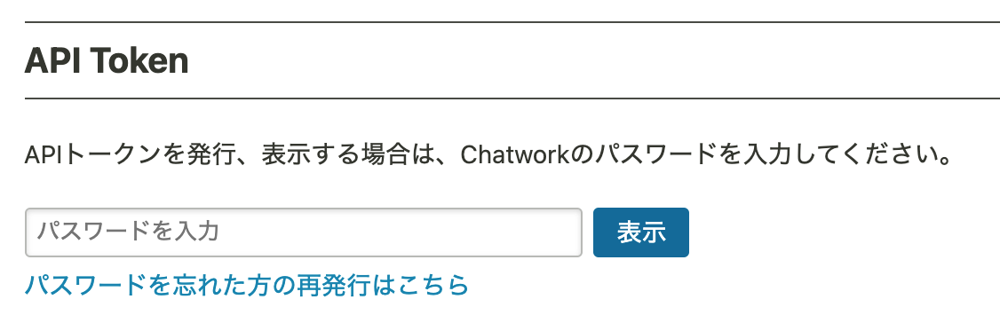
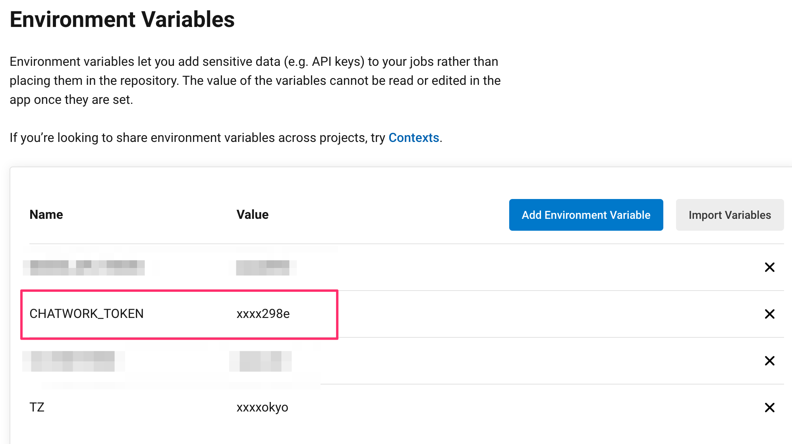

# orbs-chatwork

[](https://circleci.com/gh/RHEMS-Japan/orbs-chatwork) 


## Chatwork Orb For CircleCi

このorbは、CircleCiのpipelineコンフィグから、簡単にchatworkへメセージを送ることができるorbです。

This orb can easily send a message to chatwork from part of your CI / CD pipeline.

## Usage
### Get API Token

初めに、下記URLにアクセスし、ログインしたらAPI Tokenを発行して下さい。

First, access the URL below, log in, and issue an API Token.

https://www.chatwork.com/service/packages/chatwork/subpackages/api/token.php




### Set Environment Variables from CircleCi Project Settings

発行したAPI Tokenを、利用するCircleCi Projectの環境変数に`CHATWORK_TOKEN`という名前で登録して下さい。

Register the issued API Token in the environment variable of the CircleCi Project to be used with the name `CHATWORK_TOKEN`.




```yml
version: 2.1

orbs:
  rj-chatwork: rhems-japan/chatwork@a.b.c

jobs:
  something-job:
    docker:
      - image: cimg/base:stable
    steps:
      - checkout
      - rj-chatwork/chatwork-send:
          room_id: "00000000"
          body: "hello"
```